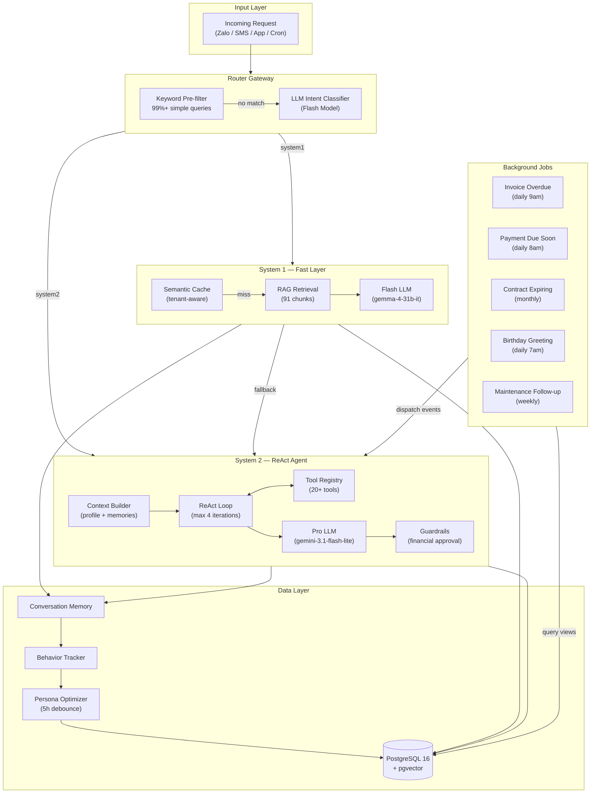

# TroManager — AI-Powered Boarding House Management System

[](https://github.com/anomalyco/TroManager)
[](#)
[](#)
[](#)

A dual-process AI system for automating tenant communication, maintenance tracking, payment reminders, and personalization at scale. Uses **LLM Intent Routing** (Dual-Process Theory) to balance speed and reasoning cost.

> Built for Vietnamese boarding house owners managing <100 tenants. Handles Zalo/SMS/App channels with background cron jobs for proactive notifications.

---

## Architecture



**Core principle**: Simple queries (greetings, policy lookups) go through a lightweight **System 1** with semantic caching. Complex queries (maintenance, billing, complaints) go through a **System 2** ReAct agent with tool access. A **keyword pre-filter** catches 99%+ of simple queries with zero LLM cost.

---

## Features

- **Dual-Process Architecture**: Intelligent routing between fast (System 1) and deep (System 2) processing paths
- **Tenant-Aware Semantic Cache**: Per-tenant caching prevents cross-tenant personalization leakage
- **Debounced Persona Optimization**: 5-hour cooldown after last message; no daily batch costs
- **Proactive Cron Jobs**: Overdue invoice reminders, payment due notifications, contract expiry alerts, birthday greetings, maintenance follow-ups
- **Multi-Channel**: REST API + Zalo OA webhook (HMAC-verified) with rate limiting
- **Tool Framework**: Dynamic tool registry with 20+ tools (maintenance tickets, room viewing, invoicing, profile management)
- **Human-in-the-Loop**: Guardrails on financial/contract actions, approval queue
- **Behavior Tracking**: Per-tenant behavior logs → personalization profiles → tailored AI responses
- **LLM Key Rotation**: 10+ API keys with automatic rotation on quota exhaustion
- **Observability**: Prometheus metrics endpoint, structured JSON logging, request-level tracing

---

## Tech Stack

| Component | Technology |
|-----------|-----------|
| **Runtime** | Python 3.13, FastAPI, Uvicorn |
| **Database** | PostgreSQL 16 + pgvector (3072-dim) |
| **LLM (Fast/Router)** | `gemma-4-31b-it` / `gemma-4-26b-a4b-it` via Gemini API |
| **LLM (Pro)** | `gemini-3.1-flash-lite` |
| **Embedding** | `gemini-embedding-2` (3072 dims) |
| **Agent Loop** | Custom ReAct (no LangGraph dependency) |
| **Scheduler** | APScheduler (async) |
| **Notification** | Zalo OA (webhook) + SMS gateway |
| **Deployment** | Docker Compose (app + DB + migrations) |
| **Container** | Python 3.13-slim (multi-stage build) |

---

## Quick Start

### Prerequisites

- Docker & Docker Compose
- Google Gemini API key(s) with access to `gemini-3.1-flash-lite` and `gemma-4-31b-it`

### Setup

```bash
# 1. Clone and configure
cp .env.example .env
# Edit .env: GEMINI_API_KEY, DB_PASSWORD

# 2. Start everything
docker compose up -d

# 3. Verify
curl http://localhost:8000/health
# {"status":"ok","db":true,"llm":true,"rate_limiter":true}

# 4. Send a test message
curl -X POST http://localhost:8000/chat \
  -H "Content-Type: application/json" \
  -d '{"tenant_id":1,"message":"Chào bạn","source":"zalo","session_id":"test-001"}'
```

The system starts with seed data (5 tenants, sample invoices, contracts, rooms) and runs migrations automatically.

---

## Project Structure

```
├── src/
│   ├── gateway/            LLM Intent Router + keyword pre-filter
│   ├── system1/            Fast Layer (semantic cache, RAG, flash LLM)
│   ├── system2/            ReAct Agent (tool loop, guardrails, context builder)
│   ├── user_modeling/      Persona Optimizer, Behavior Tracker, Conversation Memory
│   ├── tools/              Dynamic Tool Registry (20+ tools)
│   ├── cron/               Background job scheduler + event dispatcher
│   ├── llm/                LLM client with key rotation, config loader
│   ├── notifications/      Zalo/SMS provider, metrics
│   └── main.py             FastAPI application entry point
├── database/
│   ├── schema.sql          Full PostgreSQL schema
│   ├── seed_data.sql       Sample data (5 tenants, invoices, contracts, etc.)
│   └── migrations/         Versioned migrations (001–004)
├── config/
│   ├── config.yaml         System configuration
│   └── prompts/            System 1 & System 2 prompt templates
├── tests/e2e/scenarios/    40+ multi-turn test scenarios
└── knowledge_base/         RAG document corpus (Vietnamese)
```

---

## API Reference

### `POST /chat`
Primary chat endpoint. Accepts text from any channel.

```json
{
  "source": "zalo|sms|app|api",
  "tenant_id": 1,
  "message": "Tôi muốn báo hỏng bóng đèn phòng 101",
  "session_id": "uuid"
}
```

### `POST /webhook/zalo`
Zalo OA webhook with HMAC-SHA256 signature verification.

### `GET /health`
Health check returning DB, LLM, and rate limiter status.

### `GET /metrics`
Prometheus metrics endpoint.

---

## Architectural Decisions

| Decision | Rationale |
|----------|-----------|
| **Keyword pre-filter before LLM router** | 99%+ of simple queries (greetings, thanks) routed at zero LLM cost; saves 500+ API calls/day on free tier |
| **Debounced persona optimization** | Per-tenant 5h cooldown replaces daily batch — saves ~80% token cost vs processing all tenants daily |
| **Tenant-aware semantic cache** | Prevents cache poisoning where tenant A receives tenant B's personalized greeting; each tenant gets correct name/context |
| **Custom ReAct vs LangGraph** | Avoids dependency overhead for <100 tenant scale; full control over loop, retries, and tool execution |
| **APScheduler for cron jobs** | In-process async scheduler avoids Redis/Sidekiq complexity at current scale; easy to extract later if needed |
| **LLM key rotation** | 10+ API keys with automatic rotation handles Gemini free-tier 500 req/day limit gracefully |

---

## Testing

```bash
# Full E2E test suite (40+ scenarios, multi-turn)
python -X utf8 -m pytest tests/ -v

# Single scenario
python -X utf8 -m tests.e2e.scenarios.test_existing_02

# With detailed logging
python -X utf8 -m pytest tests/ -v --log-cli-level=INFO
```

---

## Documentation

- `ROADMAP.md` — Future development phases and priorities
- `docs/BUG_REPORT.md` — Bug history and resolutions
- `database/README.md` — Schema documentation
- `/health` endpoint — Real-time system status

---

## License

MIT
