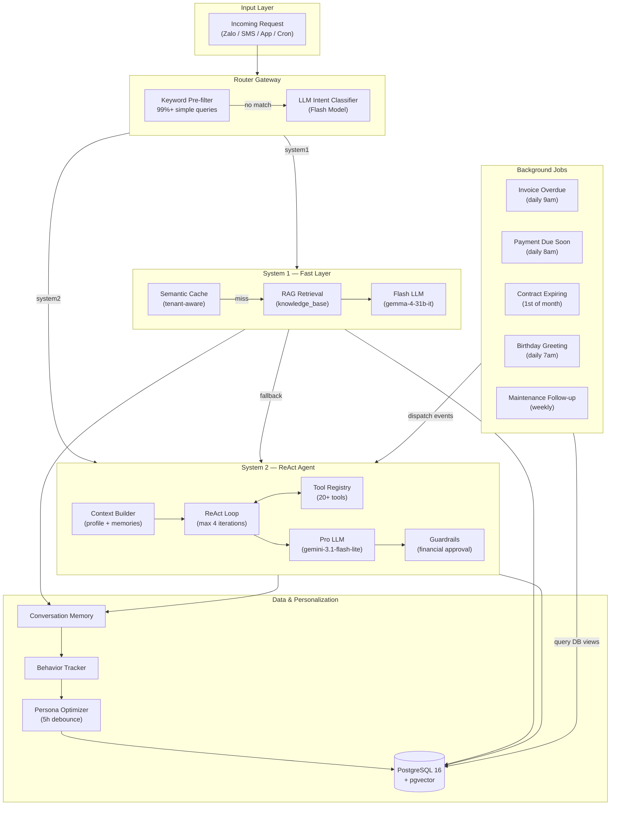

# TroManager — AI-Powered Boarding House Management

[](#)
[](#)
[](#)
[](#)
[](#)

A dual-process AI system for boarding house management — tenant communication, maintenance tracking, payment reminders, and behavior personalization. Uses LLM Intent Routing (Dual-Process Theory) to balance response speed with reasoning depth.

---

## Table of Contents

- [Features](#features)
- [Tech Stack](#tech-stack)
- [Quick Start](#quick-start)
- [Architecture](#architecture)
- [API Reference](#api-reference)
- [Project Structure](#project-structure)
- [Testing](#testing)
- [Architectural Decisions](#architectural-decisions)
- [License](#license)

---

## Features

- **Dual-Process Architecture** — Intelligent routing between a fast semantic layer (System 1) and a deep reasoning agent (System 2).
- **Keyword Pre-filter** — Greetings, thanks, and acknowledgements routed at zero LLM cost. Saves 500+ API calls/day on free tier.
- **Tenant-Aware Cache** — Semantic cache scoped by tenant. Prevents cross-tenant personalization leakage.
- **Debounced Persona Optimization** — Per-tenant profile update triggered 5 hours after the last message. No expensive daily batch.
- **Proactive Background Jobs** — Overdue invoice reminders, payment due alerts, contract expiry notices, birthday greetings, maintenance follow-ups.
- **Multi-Channel Support** — REST API with Zalo OA webhook (HMAC-SHA256 verified). Rate-limited at application and network level.
- **Dynamic Tool Registry** — 20+ tools for maintenance tickets, room viewing, invoicing, profile management, and notifications.
- **Human-in-the-Loop Guardrails** — Financial and contract actions require approval; critical operations logged for audit.
- **Behavioral Personalization** — Per-tenant conversation logs feed into a persona profile, tailoring AI tone and response style.
- **LLM Key Rotation** — Automatic failover across 10+ API keys when quota is exhausted.
- **Observability** — Prometheus `/metrics` endpoint, structured JSON logging with request-level correlation IDs.

---

## Tech Stack

| Category | Choice |
|----------|--------|
| Runtime | Python 3.13, FastAPI, Uvicorn |
| Database | PostgreSQL 16 + pgvector (3072-dim HNSW) |
| Fast / Router LLM | `gemma-4-31b-it`, `gemma-4-26b-a4b-it` |
| Pro LLM | `gemini-3.1-flash-lite` |
| Embedding | `gemini-embedding-2` (3072 dims) |
| Agent Loop | Custom ReAct (no LangGraph) |
| Scheduler | APScheduler (async, in-process) |
| Notifications | Zalo OA API, SMS gateway |
| Infrastructure | Docker Compose, multi-stage build |

---

## Quick Start

### Prerequisites

- Docker & Docker Compose
- Google Gemini API key with access to `gemini-3.1-flash-lite` and `gemma-4-31b-it`

### Setup

```bash
# 1. Configure environment
cp .env.example .env
# Edit .env: set GEMINI_API_KEY and DB_PASSWORD

# 2. Start all services
docker compose up -d

# 3. Verify health
curl http://localhost:8000/health

# 4. Send a test message
curl -X POST http://localhost:8000/chat \
  -H "Content-Type: application/json" \
  -d '{
    "tenant_id": 1,
    "message": "Xin chào",
    "source": "zalo",
    "session_id": "test-001"
  }'
```

The system starts with seed data — 5 tenants, sample invoices, contracts, rooms, and maintenance tickets. Database migrations run automatically.

---

## Architecture



Simple queries (greetings, policy lookups, FAQs) are handled by System 1 with semantic caching and RAG. Complex queries (maintenance, billing, complaints, multi-turn negotiations) are routed to System 2's ReAct loop with full tool access.

---

## API Reference

| Method | Path | Description |
|--------|------|-------------|
| `POST` | `/chat` | Primary chat endpoint. Accepts `source`, `tenant_id`, `message`, `session_id`. |
| `POST` | `/webhook/zalo` | Zalo OA webhook with HMAC-SHA256 signature verification. |
| `GET` | `/health` | System health — returns DB, LLM, and rate limiter status. |
| `GET` | `/metrics` | Prometheus metrics for observability. |

### Example: `POST /chat`

```json
{
  "source": "zalo",
  "tenant_id": 1,
  "message": "Tôi muốn báo hỏng bóng đèn phòng 101",
  "session_id": "550e8400-e29b-41d4-a716-446655440000"
}
```

### Environment Variables

| Variable | Required | Description |
|----------|----------|-------------|
| `GEMINI_API_KEY` | Yes | Primary API key for Gemini/Gemma models |
| `GEMINI_API_KEY_1..9` | No | Additional keys for rotation on quota exhaustion |
| `DB_PASSWORD` | Yes | PostgreSQL password |
| `SECRET_KEY` | Yes | JWT and session signing key |
| `ZALO_OA_APP_ID` | No | Zalo OA app credentials |
| `ZALO_OA_SECRET_KEY` | No | Zalo OA secret for webhook verification |

---

## Project Structure

```
src/
├── gateway/              Router: keyword pre-filter + LLM intent classifier
├── system1/              Fast Layer: semantic cache, RAG, Flash LLM
├── system2/              ReAct Agent: context builder, tool loop, guardrails
├── user_modeling/        Persona optimizer, behavior tracker, conversation memory
├── tools/                Dynamic tool registry (20+ tools)
├── cron/                 Background job scheduler + event dispatcher
├── llm/                  LLM client with key rotation and config loader
└── main.py               FastAPI application entry point

database/
├── schema.sql            Full PostgreSQL schema with pgvector indexes
├── seed_data.sql         Sample data (5 tenants, invoices, contracts, etc.)
└── migrations/           Versioned SQL migrations (001–004)

config/
├── config.yaml           System-wide configuration
└── prompts/              System 1 and System 2 prompt templates

tests/e2e/scenarios/      40+ multi-turn E2E test scenarios
knowledge_base/           RAG document corpus (Vietnamese)
```

---

## Testing

```bash
# Run full test suite
python -X utf8 -m pytest tests/ -v

# Run a single scenario
python -X utf8 -m tests.e2e.scenarios.test_existing_02

# With detailed logs
python -X utf8 -m pytest tests/ -v --log-cli-level=INFO
```

All tests run against real LLM calls (no mocking). Test scenarios are multi-turn conversations that validate intent classification, tool selection, parameter extraction, and response accuracy across both System 1 and System 2 paths.

---

## Architectural Decisions

| Decision | Rationale |
|----------|-----------|
| Keyword pre-filter before LLM router | Greetings and acknowledgements routed at zero LLM cost. Saves 500+ API calls/day on free-tier quota. |
| Per-tenant 5h debounce for persona updates | Replaces daily batch processing. Only tenants with recent conversations get optimized — ~80% token reduction. |
| Tenant-aware semantic cache | Prevents cache cross-contamination where tenant A receives tenant B's personalized greeting. |
| Custom ReAct over LangGraph | Zero dependency overhead for sub-100 tenant scale. Full control over retry logic, tool execution, and loop termination. |
| In-process APScheduler | Avoids Redis/Sidekiq infrastructure at current scale. Trivial to extract into a separate worker process later. |
| Multi-key LLM rotation | Free-tier quota of 500 req/day per key is mitigated by failing over across 10+ keys automatically. |

---

## License

MIT
