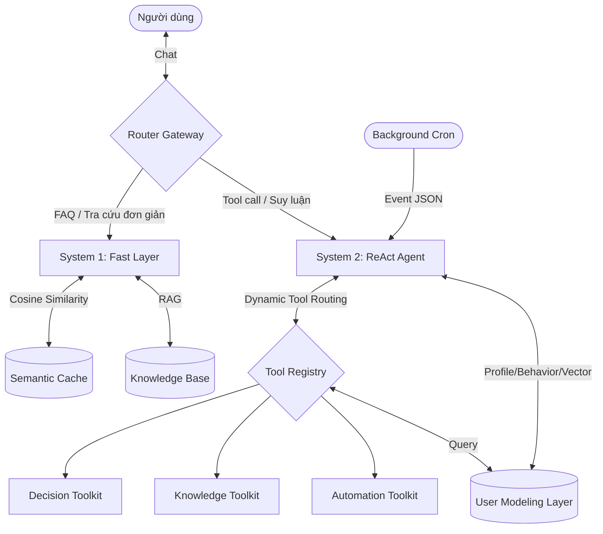

# TroManager - Kiến Trúc Số 2: Router-Centric ReAct (Dual-Process)

> Code base triển khai cho hệ thống quản lý nhà trọ thông minh **TroManager**, dựa trên kiến trúc **Router-Centric ReAct kết hợp Tiến trình kép (Dual-Process)**.

---

## 1. Tổng Quan

Kiến trúc này lấy cảm hứng từ **Lý thuyết nhận thức kép của Kahneman**:

- **Hệ thống 1 (System 1 - Fast Layer)**: Phản ứng nhanh, chi phí thấp, xử lý các câu hỏi FAQ và tra cứu đơn giản. Dùng Gemini 3.0 Flash (bản flash) + Semantic Cache.
- **Hệ thống 2 (System 2 - Slow Layer)**: Suy luận sâu, đa bước, dùng cho các tác vụ phức tạp. Dùng Gemini 3.0 Pro (bản pro) + ReAct loop + Tool Registry.

Một **Router Gateway** ở đầu vào sẽ phân luồng request dựa trên từ khóa và nguồn gửi (User chat vs Cron event).

## 2. Tech Stack

| Layer | Công nghệ |
|-------|-----------|
| Database | PostgreSQL 16 + pgvector extension |
| LLM Fast | Gemini 3.0 Flash (bản flash) |
| LLM Pro | Gemini 3.0 Pro (bản pro) |
| Agent Framework | LangChain / LangGraph (ReAct) |
| RAG Framework | LlamaIndex |
| Embedding | nomic-embed-text (768 dim) |
| Notification | Zalo OA API, SMS Gateway |
| Language | Python 3.11+ |

## 3. Cấu Trúc Thư Mục

```
TroManager_Architecture2/
├── README.md                       -- File này
├── docs/                           -- Tài liệu thiết kế chi tiết
│   ├── 01_architecture_overview.md
│   ├── 02_router_gateway_design.md
│   ├── 03_system1_fast_layer.md
│   ├── 04_system2_react_agent.md
│   ├── 05_user_modeling_layer.md
│   ├── 06_dynamic_tool_registry.md
│   ├── 07_proactive_reminders.md
│   └── 08_data_flow_and_diagrams.md
├── database/                       -- Schema PostgreSQL
│   ├── schema.sql
│   ├── seed_data.sql
│   └── README.md
├── src/                            -- Source code (Python)
│   ├── gateway/                    -- Router Gateway
│   ├── system1/                    -- System 1 Fast Layer
│   ├── system2/                    -- System 2 ReAct Agent
│   ├── user_modeling/              -- User Modeling Layer
│   ├── tools/                      -- Dynamic Tool Registry
│   ├── notifications/              -- Zalo/SMS clients
│   ├── cron/                       -- Background event dispatcher
│   └── main.py                     -- Entry point
├── config/                         -- Cấu hình & prompt templates
│   ├── config.yaml
│   └── prompts/
│       ├── system1_prompt.txt
│       └── system2_prompt.txt
├── tests/                          -- Test cases
│   ├── test_router.py
│   ├── test_system1_cache.py
│   ├── test_react_loop.py
│   └── test_proactive_event.py
└── diagrams/                       -- Mermaid diagrams
    ├── 01_architecture_overview.mmd
    ├── 02_router_logic.mmd
    ├── 03_react_loop.mmd
    └── 04_proactive_event.mmd
```

## 4. Kiến Trúc Tổng Quan



## 5. Luồng Xử Lý Chính

### 5.1. User Chat Flow
1. User gửi tin nhắn → **Router Gateway**
2. Gateway kiểm tra từ khóa nhạy cảm (`tiền`, `nợ`, `hợp đồng`, `chuyển phòng`, `hỏng`, `sửa`)
3. Nếu match → **System 2**. Ngược lại → **System 1**
4. System 1: Check cache → trả lời. Nếu không có → RAG → trả lời. Nếu confidence thấp → fallback sang System 2
5. System 2: Inject context từ User Modeling → chạy ReAct loop (max 4 iterations) → trả lời

### 5.2. Background Event Flow
1. Cron Job phát hiện sự kiện (hóa đơn quá hạn, hợp đồng sắp hết...)
2. Gửi event JSON trực tiếp vào **System 2**
3. System 2 đọc profile, sinh thông báo cá nhân hóa
4. Gọi `send_notification()` tool
5. Ghi log vào `behavior_logs`

## 6. Bảo Mật & Guardrails

- **Decoupled Generation & Action**: LLM không trực tiếp thực hiện hành động tài chính, mà chỉ sinh draft cần con người duyệt
- **Loop Breaker**: ReAct loop tối đa 4 lần, sau đó fallback message
- **Dynamic Tool Loading**: Chỉ nạp tools cần thiết dựa trên intent
- **JSON Schema Validation**: Mọi tool call phải khớp schema

## 7. Liên Kết

- Báo cáo kiến trúc tổng thể: `../BaoCao_DeXuat_KienTrucAI_TroManager.md`
- Implementation plan: `../implementation_plan.md`
- So sánh 3 kiến trúc: `../Architecture_Design/architecture_comparison.md`

## 8. Trạng Thái

| Module | Thiết kế | Code Stub | Test |
|--------|----------|-----------|------|
| Router Gateway | OK | OK | OK |
| System 1 (Fast Layer) | OK | OK | OK |
| System 2 (ReAct Agent) | OK | OK | OK |
| User Modeling Layer | OK | OK | Pending |
| Dynamic Tool Registry | OK | OK | Pending |
| Proactive Reminders | OK | OK | OK |
| Database Schema | OK | OK | Pending |
