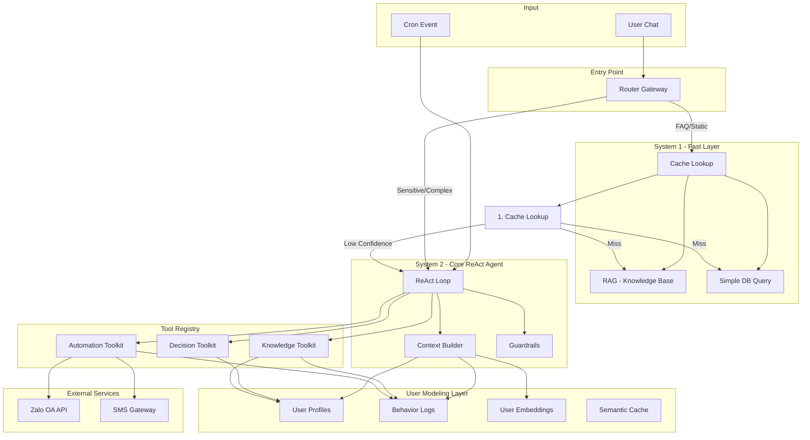

# 01. Architecture Overview - Router-Centric ReAct (Dual-Process)

## 1. Triết Lý Thiết Kế

Kiến trúc **Router-Centric ReAct với Tiến Trình Kép** được xây dựng dựa trên nguyên lý:

- **Một Agent Lõi duy nhất** quản lý toàn bộ các khả năng AI, tránh phân mảnh logic giữa nhiều agent.
- **Hai lớp nhận thức tách biệt** (System 1 & System 2) tối ưu hóa sự cân bằng giữa **chi phí**, **độ trễ** và **chất lượng suy luận**.
- **Router Gateway** đóng vai trò "bảo vệ" - đảm bảo các vấn đề nhạy cảm (tài chính, hợp đồng) luôn được xử lý bởi System 2.

## 2. Lý Do Chọn Kiến Trúc Này

| Tiêu chí | Đánh giá |
|----------|----------|
| Chi phí vận hành | Tốt - System 1 xử lý ~80% câu hỏi đơn giản với Flash model rẻ |
| Độ trễ phản hồi | Tốt - Cache hit trả lời tức thì |
| Độ chính xác | Tốt - System 2 với ReAct loop cho các bài toán phức tạp |
| Khả năng mở rộng | Khá - Dynamic Tool Loading giúp thêm tools mới không ảnh hưởng context |
| Độ phức tạp code | Trung bình - Một agent duy nhất, ít boilerplate |
| Tích hợp Proactive | Tốt - Background events đi thẳng vào System 2 |

## 3. Sơ Đồ Kiến Trúc Tổng Thể

## 4. Các Thành Phần Chính

### 4.1. Router Gateway
- **Nhiệm vụ**: Phân luồng request đầu vào
- **Logic**:
  - Nếu `source == "CRON"` → System 2 (luôn)
  - Nếu chứa từ khóa nhạy cảm → System 2
  - Ngược lại → System 1
- **Triển khai**: Regex pattern matching + Logic thuần (xem `src/gateway/router.py`)

### 4.2. System 1 - Fast Layer
- **Model**: Gemini 3.0 Flash (bản flash)
- **Luồng**:
  1. Chuyển query thành vector (embedding)
  2. So khớp Cosine Similarity với `semantic_cache` (threshold 0.9)
  3. Nếu hit → trả về response
  4. Nếu miss → RAG từ Knowledge Base bằng LlamaIndex
  5. Nếu confidence < 0.7 → fallback System 2
- **Output guard**: Mọi response phải có confidence score; nếu thấp thì escalate

### 4.3. System 2 - Core ReAct Agent
- **Model**: Gemini 3.0 Pro (bản pro)
- **Luồng**:
  1. Context Injection: Đọc `user_profiles`, tổng hợp `behavior_logs`, query top-k `user_embeddings`
  2. Dynamic Tool Loading: Dựa trên intent chỉ nạp toolkit cần thiết
  3. ReAct loop: Thought → Action → Observation (max 4 iterations)
  4. Guardrails: Validate tool input schema, loop breaker
- **Output**: Câu trả lời cuối cùng hoặc action đã thực hiện

### 4.4. User Modeling Layer
- **Vai trò**: Hạ tầng dữ liệu chung cung cấp context cho cả System 1 và System 2
- **4 module**:
  - `user_profiles`: Thông tin tường minh (họ tên, số phòng, hợp đồng)
  - `behavior_logs`: Lịch sử hành vi (thanh toán, sửa chữa, khiếu nại)
  - `user_embeddings`: Vector semantic memory về sở thích
  - `semantic_cache`: Cache câu hỏi - câu trả lời thường gặp

### 4.5. Dynamic Tool Registry
3 bộ toolkit được load động:

| Toolkit | Tools | Use cases |
|---------|-------|-----------|
| Decision | `fetch_available_rooms`, `calc_rent`, `recommend_transfer` | Tư vấn phòng, tính tiền |
| Knowledge | `query_policies`, `get_invoice_detail`, `get_contract_status` | Tra cứu thông tin |
| Automation | `send_zalo`, `send_sms`, `create_maintenance_ticket` | Gửi thông báo, tạo ticket |

## 5. Design Principles

1. **Separation of Concerns**: Gateway, System 1, System 2, Tools tách biệt rõ ràng
2. **Fail-Safe Default**: Mọi request không phân loại được đều mặc định chuyển sang System 2
3. **Observability First**: Mọi quyết định routing phải log lại để debug
4. **Cost-Aware**: Track số lượng tokens tiêu thụ bởi mỗi System
5. **Tenant-Centric**: Mọi response đều được cá nhân hóa dựa trên profile

## 6. Non-Functional Requirements

| Yêu cầu | Mục tiêu |
|---------|----------|
| Latency (System 1 cache hit) | < 200ms |
| Latency (System 1 RAG) | < 2s |
| Latency (System 2 simple) | < 5s |
| Latency (System 2 with tools) | < 15s |
| Uptime | 99.5% |
| Concurrent users | 100 |
| Cost per 1000 queries | < $2 |

## 7. Công Nghệ Cốt Lõi

| Component | Tech |
|-----------|------|
| Database | PostgreSQL 16 + pgvector |
| Vector Search | pgvector HNSW index |
| LLM | Google Gemini 3.0 (bản flash + bản pro) |
| Agent Framework | LangGraph (ReAct) |
| RAG | LlamaIndex |
| Embedding | nomic-embed-text |
| Message Queue | PostgreSQL LISTEN/NOTIFY (hoặc Redis) |
| Scheduler | APScheduler hoặc Celery Beat |
| Webhook Receiver | FastAPI |
| Notification | Zalo OA API, Twilio SMS |

## 8. Mở Rộng Tương Lai

- **Phase 2**: Tích hợp LoRA/PEFT cho personalization sâu hơn
- **Phase 3**: Thêm Multi-Modal (đọc ảnh hóa đơn, gửi ảnh hướng dẫn)
- **Phase 4**: Mem0 cho smart memory management
- **Phase 5**: Chuyển sang Multi-Agent nếu domain complexity tăng

## 9. Tham Khảo

- `../implementation_plan.md` - Kế hoạch triển khai
- `../Architecture_Design/router_centric_react_design.md` - Bản thiết kế gốc
- `../Architecture_Design/architecture_comparison.md` - So sánh 3 kiến trúc
- `../diagrams/04_react_architecture.png` - Sơ đồ trực quan
