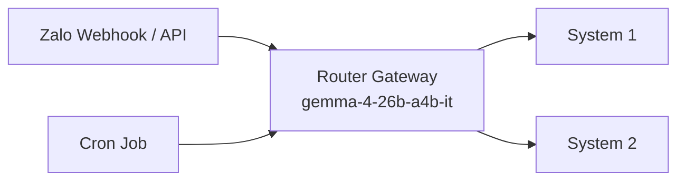

# 02. Router Gateway Design

> **Cập nhật**: 14/06/2026 — Đồng bộ với codebase hiện tại.
> Router KHÔNG dùng keyword/entity-based routing như các phiên bản doc cũ mô tả.

## 1. Vai Trò

Router Gateway là **điểm vào duy nhất** của toàn bộ request (trừ background events). Nó quyết định request nào đi vào System 1, request nào đi vào System 2 bằng **LLM Intent Routing** trực tiếp.

## 2. Vị Trí Trong Hệ Thống



## 3. Logic Phân Luồng

Router sử dụng **LLM Intent Router** (không Regex, không keyword matching). Toàn bộ logic định tuyến dựa trên LLM prompt đặc biệt yêu cầu model tự quyết định SYSTEM1 hay SYSTEM2.

### 3.1. Decision Tree

```
Input: {source, query, metadata}
  │
  ├─ Step 1: source == "cron"?
  │   └─ YES → Route to System 2 (priority: HIGH, confidence=1.0)
  │
  ├─ Step 2: len(query) > 500?
  │   └─ YES → Route to System 2 (priority: NORMAL, fallback: System 1)
  │
  └─ Step 3: LLMIntentRouter.classify(query)
      ├─ LLM says "SYSTEM1" → System 1 (confidence=0.9, fallback: System 2)
      ├─ LLM says "SYSTEM2" → System 2 (confidence=0.9)
      ├─ Timeout (>5s) → System 2 (confidence=0.5, fallback: -)
      └─ Error → System 2 (confidence=0.5, fallback: -)
```

**Quan trọng**: Không có entity-based routing hay keyword-based routing như phiên bản thiết kế cũ. Mọi quyết định đều qua LLM.

## 4. Implementation Details (LLM Intent Router)

### 4.1. File: `src/gateway/keyword_classifier.py`

```python
class LLMIntentRouter:
    """
    Phân loại câu hỏi sử dụng model router_model (gemma-4-26b-a4b-it).
    """
    
    def __init__(self, llm_client=None, config=None):
        self.llm = llm_client.with_model(llm_client.config.router_model)
        self.timeout = float(config.get("llm_timeout_seconds", 5.0))
    
    async def classify(self, text: str) -> RouteMatch:
        prompt = f"""Bạn là Router hệ thống AI cho nhà trọ.
Hãy đọc câu sau của người dùng: "{text}"

Quyết định hệ thống nào sẽ xử lý:
- SYSTEM1: Câu hỏi đơn giản, giao tiếp bình thường (chào hỏi), 
  tra cứu nội quy cơ bản, hoặc cần trả lời siêu nhanh.
- SYSTEM2: Yêu cầu phức tạp, khiếu nại, báo hỏng hóc, 
  tra cứu tài chính (nợ, hóa đơn, cọc), thao tác hợp đồng, 
  đổi phòng, hoặc cần dùng tools (tra cứu DB, gọi API Zalo).

Trả về duy nhất JSON format:
{{
  "target_system": "SYSTEM1",
  "intent": "general_chat",
  "keywords": ["chào"]
}}"""

        # Timeout protection: fallback về SYSTEM2 sau 5s
        response = await asyncio.wait_for(
            self.llm.generate(messages, temperature=0.0, max_tokens=150),
            timeout=self.timeout
        )
```

### 4.2. LLM Prompt Design

Router prompt định nghĩa rõ ranh giới 2 hệ thống:

- **SYSTEM1**: Câu hỏi đơn giản, chào hỏi, nội quy cơ bản, trả lời nhanh
- **SYSTEM2**: Tài chính, khiếu nại, báo hỏng, hợp đồng, đổi phòng, cần tools

Output format: `{"target_system": "SYSTEM1"|"SYSTEM2", "intent": "...", "keywords": [...]}`

### 4.3. Fallback Logic

| Tình huống | Fallback | Chi tiết |
|:---|---:|:---|
| **Timeout** (>5s) | System 2 (conf=0.5) | Tránh treo request vô hạn |
| **LLM Error** (parse fail, API error) | System 2 (conf=0.5) | An toàn hơn khi gửi nhầm |
| **System 1 confidence < 0.7** | System 2 | Do FastLayer tự fallback |

### 4.4. Ưu điểm so với Regex

- ✅ Loại bỏ False Positive: "Tôi có 1000 đồng lẻ" → LLM hiểu là câu kể, không phải hỏi tiền
- ✅ Không dead code, không maintain list keyword
- ✅ Linh hoạt: thêm tính năng mới không cần sửa router

## 5. Routing Result Schema

File: `src/gateway/router.py`

```python
class TargetSystem(Enum):
    SYSTEM1 = "system1"
    SYSTEM2 = "system2"

class Priority(Enum):
    LOW = 0
    NORMAL = 1
    HIGH = 2

@dataclass
class RouteDecision:
    target_system: TargetSystem
    priority: Priority
    reasoning: str
    confidence: float
    matched_keywords: list[str] = field(default_factory=list)
    intent: str | None = None
    fallback_on_failure: TargetSystem | None = None
```

## 6. Edge Cases (Implemented)

| Case | Xử lý | File |
|:---|---:|:---:|
| **CRON source** | Luôn System 2 (HIGH priority) | `router.py:75` |
| **Query > 500 chars** | System 2 (cần context sâu) | `router.py:89` |
| **Timeout** | System 2 (confidence 0.5) | `keyword_classifier.py:97` |
| **LLM error** | System 2 (confidence 0.5) | `keyword_classifier.py:105` |
| **Tin rỗng** | Xử lý bởi API endpoint | `main.py` |
| **Spam** | Rate Limiter (token bucket) | `core/rate_limiter.py` |

**Edge cases CHƯA implement (từng có trong doc cũ):**
- User gửi ảnh multi-modal
- Voice → text processing
- Multiple intents trong 1 tin

## 7. Logging & Observability

Mỗi routing decision log như sau (từ `RouterGateway.route()`):

```json
{
  "timestamp": "2026-06-14T09:00:00.123Z",
  "event": "Route decision",
  "source": "zalo",
  "target": "system2",
  "intent": "billing_inquiry",
  "keywords": ["nợ", "tiền"],
  "confidence": 0.9,
  "request_id": "abc-123-def"
}
```

Router cũng auto-record metrics qua `RequestIDMiddleware`:
- `http_requests_total{method, path, status}`
- `http_request_duration_ms{method, path}`

## 8. Performance

- **Latency thực tế** (14/06/2026):
  - LLM Router call (gemma-4-26b-a4b-it): ~7.3s (thinking model)
  - Timeout fallback: ~5s
- **Stateless**: Có thể scale horizontal qua Nginx LB

**Lưu ý**: Latency hiện tại > thiết kế (<50ms) do dùng thinking model (gemma-4-26b-a4b-it) thay vì flash model. Có thể cải thiện bằng cách dùng flash model riêng cho router.

## 9. Configuration

Trong `config/config.yaml`:
```yaml
router:
  llm_timeout_seconds: 5.0
```

Model name được cấu hình trong `config/llm_config.yaml`:
```yaml
llm:
  router_model: "gemma-4-26b-a4b-it"  # Intent Router
  flash_model: "gemma-4-31b-it"        # System 1
  pro_model: "gemini-3.1-flash-lite"   # System 2
```

## 10. Tham Khảo Code

- `../src/gateway/router.py` — RouterGateway class (165 lines)
- `../src/gateway/keyword_classifier.py` — LLMIntentRouter (113 lines)
- `../tests/test_router.py` — Router test cases
