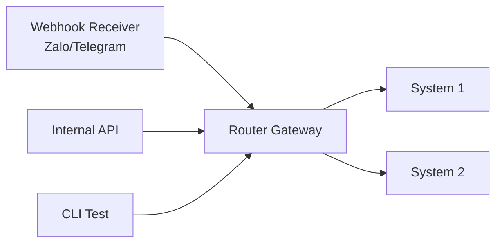

# 02. Router Gateway Design

## 1. Vai Trò

Router Gateway là **điểm vào duy nhất** của toàn bộ request (trừ background events). Nó quyết định request nào đi vào System 1, request nào đi vào System 2.

## 2. Vị Trí Trong Hệ Thống



## 3. Logic Phân Luồng

### 3.1. Decision Tree

```
Input: {source, query, metadata}
  │
  ├─ Step 1: source == "CRON"?
  │   └─ YES → Route to System 2 (priority: HIGH)
  │
  ├─ Step 2: contains_sensitive_keywords(query)?
  │   └─ YES → Route to System 2 (priority: NORMAL)
  │
  ├─ Step 3: contains_complex_keywords(query)?
  │   └─ YES → Route to System 2 (priority: NORMAL)
  │
  └─ Step 4: Default
      └─ Route to System 1
```

### 3.2. Keyword Classification

**Sensitive Keywords** (luôn đi System 2 - tài chính, pháp lý):
```
tiền, nợ, tiền thuê, tiền điện, tiền nước, cọc, hoàn cọc
hợp đồng, gia hạn, thanh lý, chấm dứt
chuyển phòng, đổi phòng
hóa đơn, bill, sao kê
phạt, vi phạm
```

**Complex Keywords** (đi System 2 - cần tool call hoặc reasoning):
```
hỏng, sửa, bảo trì, bảo hành, điều hòa, vòi nước
gửi xe, đăng ký
cho thuê, tìm phòng, phòng trống
người ở cùng, bạn cùng phòng
đề xuất, tư vấn, gợi ý
```

**Safe Keywords** (có thể đi System 1):
```
wifi, mật khẩu, internet
giờ giấc, giờ đóng cửa, giờ yên tĩnh
nội quy, quy định
địa chỉ, số nhà
chào, tạm biệt, cảm ơn
```

## 4. Implementation Details

### 4.1. Keyword Matching Strategy

Sử dụng **compound word detection** để tránh false positive:
- "tiền" trong "tiềm năng" → KHÔNG phải sensitive (xử lý riêng)
- "tiền thuê" → sensitive
- "thanh toán" → sensitive (chứa ý nghĩa tài chính)
- "phòng" trong "phòng ngủ" → không phải "phòng trọ" (xử lý riêng)

### 4.2. Negative Lookbehind Regex

```python
# Ví dụ regex cho "tiền" không đi kèm "tiềm năng"
r'(?<!tiềm\s)n(?![gG])\w*\s*tiền'  # Simplified
```

Thực tế sẽ dùng **compound word list** + **word boundary detection**.

### 4.3. Confidence Score

Ngoài keyword matching, Gateway còn tính **confidence score** dựa trên:
- Số lượng sensitive keywords match
- Có chứa con số kèm đơn vị tiền (VND, đồng, triệu, nghìn) → +0.3
- Có chứa từ "cần", "muốn" + sensitive → +0.2
- Có lịch sử user từng hỏi về chủ đề tương tự → +0.1

Nếu tổng confidence > 0.5 → System 2.

## 5. Routing Result Schema

```python
class RouteDecision:
    target_system: Literal["system1", "system2"]
    priority: Literal["low", "normal", "high"]
    reasoning: str
    confidence: float
    matched_keywords: list[str]
    fallback_on_failure: Literal["system1", "system2"]
```

## 6. Edge Cases

| Case | Xử lý |
|------|-------|
| User gửi ảnh kèm text "xem giúp tôi" | Mặc định System 2 vì cần multi-modal |
| User gửi voice → text "tôi nợ tiền" | Phân tích text sau STT → System 2 |
| User gửi tin rỗng | Fallback message từ System 1 |
| Multiple intents trong 1 tin | Chia thành 2 request, route riêng |
| Tin quá dài (>500 chars) | Nén thành summary trước khi route |
| Spam/flood detection | Rate limit + temporary block |

## 7. Logging & Observability

Mỗi routing decision phải log:
```json
{
  "request_id": "uuid",
  "timestamp": "2026-06-05T...",
  "tenant_id": 123,
  "source": "zalo",
  "query_length": 45,
  "decision": {
    "target": "system2",
    "priority": "normal",
    "matched_keywords": ["tiền", "hợp đồng"],
    "confidence": 0.85
  },
  "latency_ms": 12
}
```

## 8. Performance

- Latency mục tiêu: < 50ms
- Throughput: 100 req/s
- Stateless - có thể scale horizontal

## 9. Configuration

Trong `config/config.yaml`:
```yaml
router:
  sensitive_keywords:
    - "tiền"
    - "nợ"
    - "hợp đồng"
    # ...
  complex_keywords:
    - "hỏng"
    - "sửa"
    # ...
  threshold_confidence: 0.5
  enable_learned_classifier: false  # Phase 2
```

## 10. Tham Khảo Code

- `../src/gateway/router.py` - Implementation chính
- `../src/gateway/keyword_classifier.py` - Phân loại keyword
- `../tests/test_router.py` - Test cases
