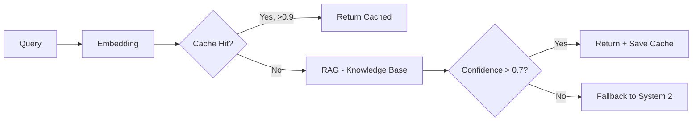

# 03. System 1 - Fast Layer Design

## 1. Vai Trò

System 1 (Fast Layer) xử lý **~80% câu hỏi thường gặp** với:
- **Latency thấp** (< 2s)
- **Chi phí thấp** (Gemini 3.0 Flash - bản flash)
- **Chất lượng đủ dùng** cho các tác vụ tra cứu đơn giản

## 2. Pipeline



## 3. Components

### 3.1. Semantic Cache

- **Storage**: Bảng `semantic_cache` trong PostgreSQL với pgvector
- **Embedding model**: `nomic-embed-text` (768 dim)
- **Index**: HNSW index cho fast ANN search
- **Threshold**: Cosine similarity > 0.9

```sql
-- Schema
CREATE TABLE semantic_cache (
    cache_id SERIAL PRIMARY KEY,
    query_text TEXT NOT NULL,
    query_embedding vector(768),
    response_text TEXT NOT NULL,
    last_accessed TIMESTAMP DEFAULT CURRENT_TIMESTAMP,
    hit_count INT DEFAULT 0
);

CREATE INDEX ON semantic_cache USING hnsw (query_embedding vector_cosine_ops);
```

**Lookup query:**
```sql
SELECT response_text, 
       1 - (query_embedding <=> $1::vector) AS similarity
FROM semantic_cache
WHERE 1 - (query_embedding <=> $1::vector) > 0.9
ORDER BY similarity DESC
LIMIT 1;
```

### 3.2. RAG - Knowledge Base

- **Framework**: LlamaIndex
- **Knowledge sources**:
  - Nội quy nhà trọ
  - Câu hỏi thường gặp (FAQ)
  - Quy trình thuê phòng
  - Chính sách hoàn cọc
  - Giờ giấc sinh hoạt
- **Chunk size**: 512 tokens, overlap 50
- **Top-k retrieval**: k=3

### 3.3. Response Generator

- **Model**: Gemini 3.0 Flash (bản flash)
- **Prompt template**: `config/prompts/system1_prompt.txt`
- **Output schema**: JSON với `answer`, `confidence`, `sources`

## 4. Flow Chi Tiết

### Step 1: Embedding
```python
def get_embedding(text: str) -> list[float]:
    return embedding_model.encode(text).tolist()  # 768 dim
```

### Step 2: Cache Lookup
```python
def cache_lookup(query_emb: list[float], threshold=0.9) -> str | None:
    sql = """
    SELECT response_text, 
           1 - (query_embedding <=> %s::vector) AS similarity
    FROM semantic_cache
    WHERE 1 - (query_embedding <=> %s::vector) > %s
    ORDER BY similarity DESC
    LIMIT 1
    """
    result = db.execute(sql, (query_emb, query_emb, threshold))
    if result:
        # Update last_accessed and hit_count
        return result.response_text
    return None
```

### Step 3: RAG Retrieval
```python
def retrieve_knowledge(query: str, top_k=3) -> list[Document]:
    return knowledge_index.similarity_search(query, k=top_k)
```

### Step 4: LLM Generation
```python
def generate_answer(query: str, contexts: list[Document]) -> Response:
    prompt = build_prompt(query, contexts)
    response = gemini_flash.generate(
        prompt,
        response_schema={
            "answer": str,
            "confidence": float,  # 0.0 - 1.0
            "sources": list[str]
        }
    )
    return response
```

### Step 5: Cache Write (Async)
```python
def save_to_cache(query: str, query_emb: list[float], response: str):
    sql = """
    INSERT INTO semantic_cache (query_text, query_embedding, response_text)
    VALUES (%s, %s, %s)
    ON CONFLICT DO NOTHING
    """
    db.execute_async(sql, (query, query_emb, response))
```

## 5. Guardrails

### 5.1. Confidence Threshold
- Nếu `confidence < 0.7` → fallback System 2
- Nếu `confidence > 0.95` → cache lại với priority cao

### 5.2. Hallucination Check
- Kiểm tra response có chứa từ ngữ không có trong contexts không
- Nếu có quá nhiều entity lạ → giảm confidence

### 5.3. Safety Keywords
- Nếu response chứa keyword tài chính (`trừ tiền`, `thanh toán ngay`) → escalate System 2 để review

## 6. Performance Optimization

### 6.1. Cache Warming
- Pre-populate cache với top 100 câu hỏi thường gặp khi deploy

### 6.2. Embedding Caching
- Cache embedding của các câu hỏi đã embed trong 1 phiên

### 6.3. Batch Processing
- Nếu nhiều request cùng lúc, batch embed queries

## 7. Metrics Tracking

```python
class System1Metrics:
    total_requests: int
    cache_hits: int
    cache_hit_rate: float  # = hits / total
    cache_misses: int
    rag_responses: int
    fallbacks_to_system2: int
    avg_latency_ms: float
    avg_confidence: float
    cost_usd: float
```

## 8. Configuration

```yaml
system1:
  embedding_model: "nomic-embed-text"
  embedding_dim: 768
  cache_similarity_threshold: 0.9
  rag_top_k: 3
  rag_chunk_size: 512
  confidence_threshold: 0.7
  model: "gemini-3.0-flash"  # bản flash
  max_tokens: 512
  temperature: 0.3
```

## 9. Tham Khảo Code

- `../src/system1/fast_layer.py` - Main orchestrator
- `../src/system1/semantic_cache.py` - Cache logic
- `../src/system1/knowledge_lookup.py` - RAG retrieval
- `../config/prompts/system1_prompt.txt` - Prompt template
- `../tests/test_system1_cache.py` - Test cases

## 10. Limitations

System 1 **KHÔNG thể**:
- Thực hiện tool calls (gửi notification, tạo ticket)
- Suy luận đa bước phức tạp
- Truy cập thông tin real-time (ví dụ: tính tiền điện tháng này)
- Cá nhân hóa sâu (chỉ dùng được profile cơ bản)

Khi cần các tác vụ trên → **phải fallback System 2**.
