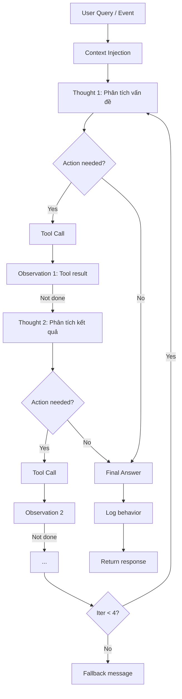

# 04. System 2 - Core ReAct Agent Design

## 1. Vai Trò

System 2 (Slow Layer) là **bộ não chính** của hệ thống, xử lý:
- Câu hỏi phức tạp cần suy luận đa bước
- Các tác vụ cần gọi tool (gửi thông báo, tính tiền, tạo ticket)
- Background events từ Cron
- Personalization sâu dựa trên User Modeling

## 2. ReAct Loop



## 3. Context Injection

Trước khi vào ReAct loop, System 2 xây dựng context từ User Modeling:

### 3.1. Profile Context
```python
profile_context = {
    "tenant_id": 123,
    "full_name": "Nguyễn Văn A",
    "room_id": 205,
    "lease_end": "2026-12-31",
    "communication_preference": "zalo",
    "tone_preference": "friendly"
}
```

### 3.2. Behavior Summary
```python
behavior_context = {
    "avg_payment_delay_days": 2,
    "preferred_payment_method": "bank_transfer",
    "maintenance_requests_count": 3,
    "noise_complaints_count": 0,
    "last_interaction": "2026-05-30"
}
```

### 3.3. Relevant Memories (Vector Search)
```python
relevant_memories = user_embeddings.similarity_search(
    query=current_question,
    tenant_id=123,
    top_k=3
)
# Returns: ["Khách hay quên đóng tiền vào ngày 5", "Khách nhạy cảm về tiếng ồn", ...]
```

## 4. Dynamic Tool Loading

Dựa trên **intent classification** (thực hiện ngay sau Context Injection), chỉ nạp toolkit cần thiết:

```python
def select_toolkits(intent: str) -> list[str]:
    intent_to_toolkits = {
        "billing_inquiry": ["knowledge", "decision"],
        "maintenance_request": ["knowledge", "automation"],
        "room_recommendation": ["decision", "knowledge"],
        "contract_question": ["knowledge"],
        "payment_reminder": ["knowledge", "automation"],
        "general_chat": [],  # Không cần tool
    }
    return intent_to_toolkits.get(intent, ["knowledge"])  # Default safe
```

## 5. Tool Definitions

Xem chi tiết trong `06_dynamic_tool_registry.md`.

Các tool được define bằng **Pydantic schema** cho input validation:

```python
class SendZaloInput(BaseModel):
    tenant_id: int
    message: str
    template_id: Optional[str] = None

@tool(args_schema=SendZaloInput)
def send_zalo(tenant_id: int, message: str, template_id: str = None) -> str:
    """Gửi tin nhắn Zalo cho khách thuê."""
    return zalo_client.send(tenant_id, message, template_id)
```

## 6. ReAct Loop Implementation

### 6.1. Pseudocode

```python
def react_loop(query: str, tenant_id: int) -> str:
    # 1. Context injection
    context = build_context(tenant_id, query)
    tools = select_tools(context.intent)
    system_prompt = build_system_prompt(context, tools)
    
    # 2. Initialize state
    history = [SystemMessage(content=system_prompt), HumanMessage(content=query)]
    
    # 3. Loop
    for iteration in range(MAX_ITERATIONS):  # 4
        # a. LLM reasoning
        response = gemini_pro.invoke(history)
        history.append(response)
        
        # b. Check if final answer
        if not response.tool_calls:
            return response.content  # Final answer
        
        # c. Execute tools
        for tool_call in response.tool_calls:
            try:
                result = execute_tool(tool_call, tools)
                observation = ToolMessage(content=result, tool_call_id=tool_call.id)
            except Exception as e:
                observation = ToolMessage(content=f"Error: {e}", tool_call_id=tool_call.id)
            history.append(observation)
    
    # 4. Loop breaker
    return FALLBACK_MESSAGE
```

### 6.2. Tool Execution

```python
def execute_tool(tool_call, tools: list) -> str:
    tool = next((t for t in tools if t.name == tool_call.name), None)
    if not tool:
        return f"Tool {tool_call.name} not found"
    
    try:
        # Validate input
        validated_args = tool.args_schema(**tool_call.args)
        # Execute
        result = tool.run(validated_args.dict())
        return str(result)
    except ValidationError as e:
        return f"Invalid input: {e}"
    except Exception as e:
        return f"Tool execution failed: {e}"
```

## 7. Guardrails

### 7.1. Loop Breaker
```python
MAX_ITERATIONS = 4

if iteration >= MAX_ITERATIONS and response.tool_calls:
    log.warning(f"ReAct loop exceeded max iterations for tenant {tenant_id}")
    return "Hệ thống đang xử lý phức tạp, vui lòng liên hệ trực tiếp quản lý."
```

### 7.2. Sensitive Action Approval

Một số tool yêu cầu **human approval** trước khi thực thi:

```python
SENSITIVE_TOOLS = {
    "send_payment_reminder": True,  # Cần duyệt
    "create_maintenance_ticket": False,  # Tự động
    "recommend_transfer": False,  # Tự động (chỉ là recommendation)
}

def execute_sensitive_tool(tool_call, tenant_id):
    if SENSITIVE_TOOLS.get(tool_call.name):
        # Tạo approval request, gửi cho quản lý
        approval_id = approval_queue.add(tool_call, tenant_id)
        return f"Đã tạo yêu cầu duyệt #{approval_id}, quản lý sẽ phản hồi sớm."
    else:
        return tool.run(tool_call.args)
```

### 7.3. Token Limit Protection

```python
MAX_TOKENS_PER_REQUEST = 8000

def check_token_limit(history):
    total_tokens = sum(count_tokens(msg) for msg in history)
    if total_tokens > MAX_TOKENS_PER_REQUEST:
        # Nén history: chỉ giữ system + user + 3 turn gần nhất
        compressed = compress_history(history)
        return compressed
    return history
```

### 7.4. Output Validation

```python
FINAL_ANSWER_SCHEMA = {
    "answer": str,
    "actions_taken": list[str],
    "tone_used": str,
    "personalization_applied": bool,
    "confidence": float
}
```

## 8. Background Event Handling

Khi nhận event từ Cron (không qua Router):

```python
def handle_background_event(event: dict):
    """
    Event format:
    {
        "sender": "SYSTEM_CRON",
        "event": "invoice_overdue",
        "data": {"tenant_id": 123, "invoice_amount": 3500000},
        "instruction": "..."
    }
    """
    tenant_id = event["data"]["tenant_id"]
    context = build_context(tenant_id, event["instruction"])
    
    # Load only relevant tools
    tools = ["knowledge", "automation"]
    
    # Run ReAct loop with custom instruction
    response = react_loop(
        query=event["instruction"],
        tenant_id=tenant_id,
        tools=tools,
        context=context
    )
    
    # Log
    behavior_logs.log(
        tenant_id=tenant_id,
        action_type=f"auto_{event['event']}",
        description=response
    )
    
    return response
```

## 9. Personalization Tone Control

Dựa trên `tone_preference` của tenant, điều chỉnh system prompt:

| Tone | Cách diễn đạt |
|------|---------------|
| `friendly` | "Anh/chị ơi, phòng mình...", emoji vừa phải, xưng hô thân mật |
| `professional` | "Kính gửi anh/chị...", ngôn ngữ lịch sự, không emoji |
| `strict` | "Thông báo: ...", ngắn gọn, đi thẳng vào vấn đề |

```python
TONE_TEMPLATES = {
    "friendly": "Bạn là trợ lý AI thân thiện, xưng hô 'mình' với khách thuê...",
    "professional": "Bạn là trợ lý AI chuyên nghiệp, sử dụng ngôn ngữ lịch sự...",
    "strict": "Bạn là trợ lý AI nghiêm túc, thông báo rõ ràng, ngắn gọn..."
}
```

## 10. Metrics

```python
class System2Metrics:
    total_requests: int
    avg_iterations: float
    max_iterations_hit: int
    tool_calls_total: int
    tool_failures: int
    sensitive_actions_approved: int
    avg_latency_ms: float
    avg_tokens_used: int
    cost_usd: float
    background_events_handled: int
```

## 11. Configuration

```yaml
system2:
  model: "gemini-3.0-pro"  # bản pro
  max_iterations: 4
  max_tokens: 8000
  temperature: 0.4
  enable_dynamic_tool_loading: true
  enable_sensitive_approval: true
  enable_history_compression: true
```

## 12. Tham Khảo Code

- `../src/system2/react_agent.py` - ReAct loop
- `../src/system2/context_builder.py` - Context injection
- `../src/system2/guardrails.py` - Safety checks
- `../config/prompts/system2_prompt.txt` - Prompt template
- `../tests/test_react_loop.py` - Test cases

## 13. Comparison với System 1

| Tiêu chí | System 1 | System 2 |
|----------|----------|----------|
| Model | Flash (rẻ, nhanh) | Pro (mạnh, đắt) |
| Latency | < 2s | < 15s |
| Tool calls | Không | Có |
| Context depth | Surface | Deep (vector memory) |
| Personalization | Cơ bản | Sâu |
| Use cases | FAQ, lookup | Reasoning, action |
| Cost/query | ~$0.001 | ~$0.01-0.05 |
