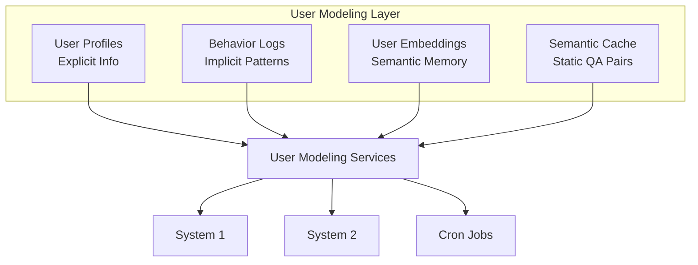
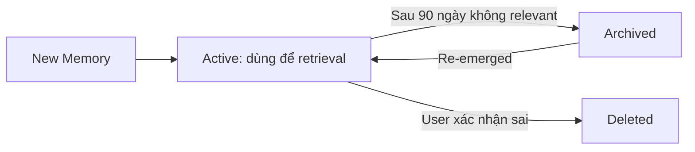

# 05. User Modeling Layer Design

## 1. Vai Trò

User Modeling Layer là **hạ tầng dữ liệu chung** cung cấp context cho cả System 1 và System 2. Nó giải quyết bài toán cốt lõi: **"Làm sao AI hiểu được từng khách thuê là một cá nhân riêng biệt?"**

## 2. Cấu Trúc Dữ Liệu

### 2.1. 4 Thành Phần Chính



### 2.2. Mô Tả Từng Thành Phần

#### user_profiles (Hồ sơ tường minh)
- **Mục đích**: Lưu thông tin khách thuê khai báo và cài đặt tùy chọn
- **Cập nhật**: Khi tenant thay đổi thông tin hoặc qua batch job định kỳ
- **Đọc bởi**: System 2 (mỗi request), System 1 (một số trường)
- **Schema chính**:
  ```sql
  tenant_id, full_name, phone_number, room_id,
  lease_start, lease_end, communication_preference,
  tone_preference, created_at, updated_at
  ```

#### behavior_logs (Hồ sơ ngầm & Hành vi)
- **Mục đích**: Ghi lại lịch sử hành động để phân tích thói quen
- **Cập nhật**: Real-time sau mỗi hành động của tenant hoặc system
- **Đọc bởi**: System 2 (tổng hợp thành behavior summary)
- **Partitioning**: Bảng được partition theo tháng (`PARTITION BY RANGE (timestamp)`) để tối ưu query
- **Các action_type chính**:
  - `late_payment`: Thanh toán trễ
  - `on_time_payment`: Thanh toán đúng hạn
  - `maintenance_request`: Yêu cầu sửa chữa
  - `noise_complaint`: Khiếu nại tiếng ồn
  - `contract_signed`: Ký hợp đồng
  - `room_transfer`: Chuyển phòng
  - `auto_reminder_sent`: Gửi nhắc nhở tự động

#### user_embeddings (Semantic Memory)
- **Mục đích**: Lưu các "đúc kết" về sở thích dưới dạng vector
- **Cập nhật**: Trigger-based (Persona Optimizer) sử dụng `flash_client` (`gemma-4-31b-it`) với **Structured Output (Pydantic)** — chỉ chạy khi tenant có hội thoại mới, KHÔNG chạy fixed schedule để tránh lãng phí. Phân tích Episodic Memory và trích xuất thành format JSONB chuẩn Tiếng Việt (gồm: Nhân khẩu học, Tài chính sinh hoạt, Sở thích mong muốn, Hành vi).
- **Đọc bởi**: System 2 (top-k similarity search và trực tiếp parse JSON)
- **Ví dụ memories**:
  - "Khách rất nhạy cảm về tiếng ồn sau 10h tối"
  - "Khách hay quên đóng tiền vào ngày 5 hàng tháng"
  - "Khách thích phòng có ánh sáng tự nhiên"
  - "Khách thường xuyên nấu ăn tại phòng"

#### semantic_cache (Cache tĩnh)
- **Mục đích**: Lưu các cặp Q&A đã xử lý để trả về ngay
- **Cập nhật**: Sau mỗi response từ System 1
- **Đọc bởi**: System 1 (mỗi request)
- **Cleanup**: TTL 30 ngày, LRU eviction

## 3. Data Flow

### 3.1. Read Flow (System 2)

```python
def build_user_context(tenant_id: int, query: str) -> dict:
    # 1. Profile - luôn đọc
    profile = db.query_one("SELECT * FROM user_profiles WHERE tenant_id = %s", tenant_id)
    
    # 2. Behavior summary - tổng hợp từ logs
    behavior = db.query_one("""
        SELECT 
            COUNT(*) FILTER (WHERE action_type = 'late_payment') as late_count,
            COUNT(*) FILTER (WHERE action_type = 'on_time_payment') as on_time_count,
            COUNT(*) FILTER (WHERE action_type = 'maintenance_request') as maintenance_count,
            MAX(timestamp) as last_interaction
        FROM behavior_logs 
        WHERE tenant_id = %s 
          AND timestamp > NOW() - INTERVAL '90 days'
    """, tenant_id)
    
    # 3. Relevant memories - vector search
    query_emb = get_embedding(query)
    memories = db.query("""
        SELECT memory_text, 1 - (embedding <=> %s::vector) as similarity
        FROM user_embeddings
        WHERE tenant_id = %s
        ORDER BY embedding <=> %s::vector
        LIMIT 3
    """, query_emb, tenant_id, query_emb)
    
    return {
        "profile": profile,
        "behavior": behavior,
        "memories": [m.memory_text for m in memories]
    }
```

### 3.2. Write Flow

#### Real-time Writes (Sau mỗi interaction)
```python
def log_interaction(tenant_id: int, action_type: str, description: str):
    db.execute("""
        INSERT INTO behavior_logs (tenant_id, action_type, description)
        VALUES (%s, %s, %s)
    """, tenant_id, action_type, description)
```

#### Batch Writes (Persona Optimizer)
Trigger-based — chỉ xử lý tenant có hội thoại mới (không chạy daily fixed schedule), dùng `flash_client` với Structured Output (Pydantic):
```python
class PersonalizationProfile(BaseModel):
    demographics: dict
    financial_living: dict
    preferences_desires: dict
    behavior_patterns: dict

async def optimize_tenant(tenant_id: int):
    """Persona Optimizer — trigger-based, chỉ chạy khi có hội thoại mới."""
    # Skip nếu không có hội thoại mới từ lần optimize cuối
    recent = await get_conversations_since_last_optimize(tenant_id)
    if not recent:
        return  # Không tốn LLM call
    
    profile: PersonalizationProfile = flash_client.generate_structured(
        prompt=f"Phân tích các tương tác gần đây...\n{recent}",
        response_model=PersonalizationProfile
    )
    # Lưu JSONB vào user_profiles
    db.execute("""
        UPDATE user_profiles SET personalization_profile = %s
        WHERE tenant_id = %s
    """, profile.model_dump_json(), tenant.id)
```

## 4. Privacy & Security

### 4.1. Data Encryption
- **At rest**: PostgreSQL TDE (Transparent Data Encryption)
- **In transit**: TLS 1.3
- **PII fields**: `phone_number`, `email` được mã hóa AES-256

### 4.2. Access Control
```sql
-- Row-level security
ALTER TABLE user_profiles ENABLE ROW LEVEL SECURITY;

CREATE POLICY tenant_isolation ON user_profiles
    USING (tenant_id = current_setting('app.current_tenant_id')::int);
```

### 4.3. Data Retention
- `behavior_logs`: Giữ 2 năm, sau đó archive sang cold storage
- `user_embeddings`: Giữ vĩnh viễn (chỉ chứa insights, không có PII)
- `semantic_cache`: TTL 30 ngày, auto-delete

### 4.4. Right to be Forgotten (Chưa triển khai)
```python
def delete_tenant_data(tenant_id: int):
    """Xóa toàn bộ dữ liệu của tenant (GDPR compliance)."""
    db.execute("DELETE FROM user_profiles WHERE tenant_id = %s", tenant_id)
    db.execute("DELETE FROM behavior_logs WHERE tenant_id = %s", tenant_id)
    db.execute("DELETE FROM user_embeddings WHERE tenant_id = %s", tenant_id)
    db.execute("DELETE FROM semantic_cache WHERE cache_id IN (...)")  # Optional
```

## 5. Embedding Management

### 5.1. Embedding Model
- **Model**: `gemini-embedding-2`
- **Dimension**: 3072
- **Update strategy**: Re-embed khi model thay đổi

### 5.2. Memory Lifecycle


### 5.3. Decay & Archiving
Memories cũ không còn relevant sẽ giảm trọng số:

```python
def adjust_memory_weights(tenant_id: int):
    """Mỗi tuần, giảm weight của memories cũ không được truy xuất."""
    # 1. Apply decay
    db.execute("""
        UPDATE user_embeddings
        SET weight = weight * 0.95
        WHERE tenant_id = %s
          AND last_retrieved < NOW() - INTERVAL '30 days'
          AND weight > 0.1
    """, tenant_id)
    
    # 2. Archive memories that fell below threshold (BUG-058 fix)
    db.execute("""
        UPDATE user_embeddings
        SET is_archived = TRUE
        WHERE tenant_id = %s AND weight <= 0.1
    """, tenant_id)
```

## 6. Multi-Tenant Considerations (Chưa triển khai - Phase 2)

Nếu mở rộng cho nhiều **boarding house** (multi-tenant ở mức landlord):

```sql
-- Thêm boarding_house_id vào các bảng
ALTER TABLE user_profiles ADD COLUMN boarding_house_id INT;
ALTER TABLE behavior_logs ADD COLUMN boarding_house_id INT;
ALTER TABLE user_embeddings ADD COLUMN boarding_house_id INT;

-- Composite index
CREATE INDEX idx_tenant_house ON user_profiles(boarding_house_id, tenant_id);
```

## 7. Performance

### 7.1. Indexes
```sql
-- Profile lookups
CREATE INDEX idx_profile_phone ON user_profiles(phone_number);
CREATE INDEX idx_profile_room ON user_profiles(room_id);

-- Behavior queries
CREATE INDEX idx_behavior_tenant_time ON behavior_logs(tenant_id, timestamp DESC);
CREATE INDEX idx_behavior_type ON behavior_logs(tenant_id, action_type);

-- Vector search
CREATE INDEX idx_user_emb_hnsw ON user_embeddings USING hnsw (embedding vector_cosine_ops);
```

### 7.2. Query Optimization
- **Connection pooling**: PgBouncer hoặc SQLAlchemy pool
- **Read replicas**: Cho analytics queries
- **Materialized views**: Cho behavior summary hàng ngày

## 8. Monitoring (Chưa triển khai - Phase 2)

```python
class UMLMetrics:
    avg_context_build_time_ms: float
    profile_lookup_p99_ms: float
    vector_search_p99_ms: float
    persona_optimizer_runs_per_day: int
    total_memories_count: int
    avg_memories_per_tenant: float
    cache_hit_rate: float
```

## 9. Tham Khảo Code

- `../database/schema.sql` - Toàn bộ DDL
- `../src/user_modeling/profile_service.py` - Profile CRUD
- `../src/user_modeling/behavior_tracker.py` - Behavior logging
- `../src/user_modeling/memory_manager.py` - Embedding management
- `../src/user_modeling/conversation_memory.py` - Conversation memory module
- `../src/user_modeling/approval_service.py` - Sensitive action approval
- `../src/user_modeling/persona_optimizer.py` - Persona optimization (trigger-based)
- `../database/README.md` - Setup instructions

## 10. Best Practices

1. **Luôn cập nhật `updated_at`** khi modify profile
2. **Sử dụng batch job** thay vì real-time cho embedding generation
3. **Validate input** trước khi insert vào bất kỳ bảng nào
4. **Test với data giả** trước khi apply changes lên production
5. **Monitor storage growth** - đặc biệt `behavior_logs` và `user_embeddings`
