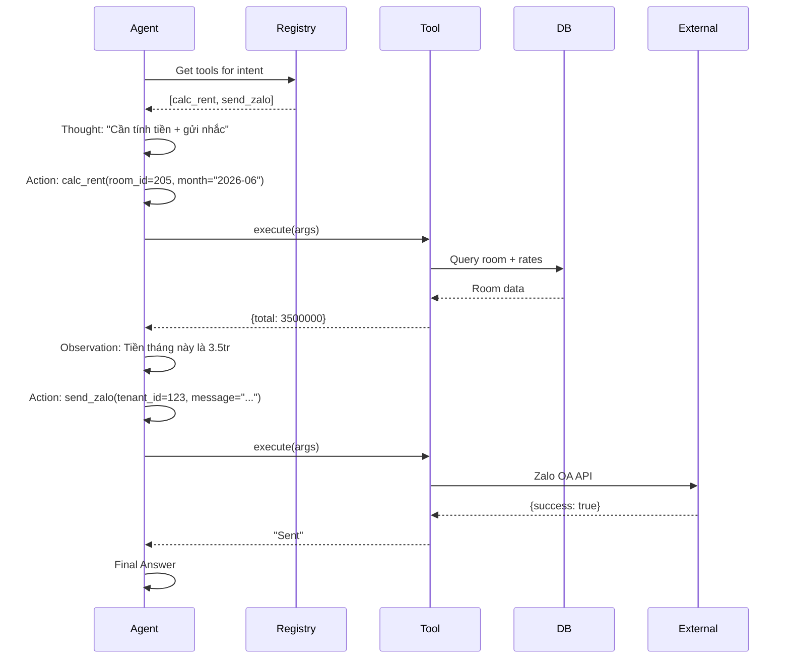

# 06. Dynamic Tool Registry Design

## 1. Vai Trò

Dynamic Tool Registry là tập hợp các **tools** mà System 2 (ReAct Agent) có thể gọi. Đặc biệt ở chỗ các tool **được nạp động** dựa trên intent, tránh tình trạng "tool confusion" khi số lượng tools tăng lên.

## 2. Cấu Trúc

```mermaid
graph TB
    subgraph "Tool Registry"
        REG[Tool Registry]
        DT[Decision Toolkit<br/>5 tools]
        KT[Knowledge Toolkit<br/>7 tools]
        AT[Automation Toolkit<br/>5 tools]
    end
    
    REG --> DT
    REG --> KT
    REG --> AT
    
    DT --> T1[fetch_available_rooms]
    DT --> T2[calc_rent]
    DT --> T3[recommend_transfer]
    DT --> T4[compare_rooms]
    DT --> T5[recommend_renewal]
    
    KT --> T7[query_policies]
    KT --> T8[get_invoice_detail]
    KT --> T9[get_contract_status]
    KT --> T10[get_room_info]
    KT --> T11[get_payment_history]
    KT --> T12[get_maintenance_status]
    KT --> T13[get_room_by_number]
    
    AT --> T14[send_zalo]
    AT --> T15[send_sms]
    AT --> T16[create_maintenance_ticket]
    AT --> T17[send_payment_reminder]
    AT --> T18[schedule_room_viewing]
    AT --> T19[update_user_preference]
```



## 3. 3 Bộ Toolkit

### 3.1. Decision Toolkit
**Mục đích**: Hỗ trợ ra quyết định về phòng, giá, chuyển phòng.

| Tool | Mô tả | Input | Output |
|------|-------|-------|--------|
| `fetch_available_rooms` | Lấy danh sách phòng trống | `budget_max`, `min_area`, `floor_preference` | `list[Room]` |
| `calc_rent` | Tính tiền thuê tháng | `room_id`, `month`, `electricity_kwh`, `water_m3` | `RentBreakdown` |
| `recommend_transfer` | Đề xuất phòng phù hợp hơn | `tenant_id` | `TransferRecommendation (JSON)` |
| `compare_rooms` | So sánh 2 phòng | `room_id_1`, `room_id_2` | `Comparison` |
| `recommend_renewal` | Đề xuất gia hạn hợp đồng bằng 4-Signal Matrix | `tenant_id` | `RenewalRecommendation (JSON)` |

### *4-Signal Matrix cho Recommend Renewal*
Công cụ `recommend_renewal` đánh giá:
1. **Payment Risk**: Rủi ro tài chính (trễ nợ $\ge 3$ lần -> HIGH RISK)
2. **Churn Risk**: Rủi ro rời đi (số lần phàn nàn/cảnh cáo, đang ở ghép)
3. **Customer Value**: Khách hàng VIP hay chuẩn (thời gian thuê $\ge 2$ năm -> VIP)
4. **Persona Preference**: Mối quan tâm chính từ Profile JSONB
Tool trả về **JSON Object** để ReAct Agent dễ dàng tạo prompt tự nhiên.

### 3.2. Knowledge Toolkit
**Mục đích**: Tra cứu thông tin từ database và knowledge base.

| Tool | Mô tả | Input | Output |
|------|-------|-------|--------|
| `query_policies` | Tìm chính sách theo câu hỏi | `query: str` | `list[PolicyDoc]` |
| `get_invoice_detail` | Chi tiết hóa đơn | `tenant_id`, `month` | `InvoiceDetail` |
| `get_contract_status` | Trạng thái hợp đồng | `tenant_id` | `ContractStatus` |
| `get_payment_history` | Lịch sử thanh toán | `tenant_id`, `months` | `list[Payment]` |
| `get_room_info` | Thông tin phòng hiện tại | `tenant_id` | `RoomInfo` |
| `get_maintenance_status` | Tra cứu ticket bảo trì | `ticket_id?`, `tenant_id`, `limit` | `list[Ticket]` |
| `get_room_by_number` | Tra cứu phòng theo số (PII-safe) | `room_number` | `RoomInfo` |

### 3.3. Automation Toolkit
**Mục đích**: Gửi thông báo và thực hiện hành động tự động.

| Tool | Mô tả | Input | Output | Sensitive? |
|------|-------|-------|--------|------------|
| `send_zalo` | Gửi tin Zalo | `tenant_id`, `message`, `template_id?` | `SendResult` | **Yes** |
| `send_sms` | Gửi SMS | `tenant_id`, `message` | `SendResult` | **Yes** |
| `create_maintenance_ticket` | Tạo phiếu sửa chữa | `tenant_id`, `issue`, `priority` | `Ticket` | No |
| `send_payment_reminder` | Gửi nhắc nợ | `tenant_id`, `invoice_id` | `SendResult` | **Yes** |
| `schedule_room_viewing` | Đặt lịch xem phòng | `tenant_id`, `room_id`, `datetime` | `Appointment` | No |
| `update_user_preference` | Cập nhật preference | `tenant_id`, `preference` | `Success` | No |

## 4. Dynamic Tool Loading

### 4.1. Intent → Toolkit Mapping

```python
INTENT_TOOLKIT_MAP = {
    # Billing
    "billing_inquiry": ["knowledge"],  # Chỉ tra cứu
    "payment_reminder": ["knowledge", "automation"],  # Có thể gửi nhắc
    "billing_dispute": ["knowledge", "decision"],  # Có thể tính lại
    
    # Maintenance
    "maintenance_request": ["knowledge", "automation"],  # Tạo ticket
    "maintenance_status": ["knowledge"],
    
    # Rooms
    "room_recommendation": ["decision", "knowledge"],
    "room_transfer": ["decision", "knowledge", "automation"],
    "contract_renewal": ["knowledge", "decision"],
    
    # General
    "policy_question": ["knowledge"],
    "general_chat": [],  # Không cần tool
    
    # Default safe
    "unknown": ["knowledge"]
}
```

### 4.2. Implementation

```python
def get_tools_for_intent(intent: str) -> list:
    """Lấy danh sách tools dựa trên intent."""
    toolkit_names = INTENT_TOOLKIT_MAP.get(intent, ["knowledge"])
    tools = []
    for name in toolkit_names:
        tools.extend(TOOLKITS[name].tools)
    return tools

def get_tools_description(tools: list) -> str:
    """Format tool descriptions cho system prompt."""
    return "\n".join([
        f"- {t.name}: {t.description}"
        for t in tools
    ])
```

## 5. Tool Definition Standard

### 5.1. Pydantic Schema

```python
from pydantic import BaseModel, Field
from langchain.tools import tool

class CalcRentInput(BaseModel):
    room_id: int = Field(..., description="ID của phòng cần tính tiền")
    month: str = Field(..., description="Tháng cần tính, format YYYY-MM")
    electricity_kwh: float = Field(0, description="Số kWh điện tiêu thụ")
    water_m3: float = Field(0, description="Số m3 nước tiêu thụ")

@tool(args_schema=CalcRentInput)
def calc_rent(room_id: int, month: str, electricity_kwh: float = 0, water_m3: float = 0) -> dict:
    """Tính tổng tiền thuê phòng trong tháng, bao gồm tiền phòng + điện + nước + dịch vụ."""
    # Implementation
    room = db.get_room(room_id)
    base_rent = room.monthly_rent
    elec_cost = electricity_kwh * room.electricity_price
    water_cost = water_m3 * room.water_price
    service_cost = room.service_fee
    total = base_rent + elec_cost + water_cost + service_cost
    
    return {
        "room_id": room_id,
        "month": month,
        "breakdown": {
            "base_rent": base_rent,
            "electricity": elec_cost,
            "water": water_cost,
            "service": service_cost,
        },
        "total": total
    }
```

### 5.2. JSON Schema (alternative)

```json
{
  "name": "calc_rent",
  "description": "Tính tổng tiền thuê phòng trong tháng",
  "parameters": {
    "type": "object",
    "properties": {
      "room_id": {"type": "integer", "description": "ID phòng"},
      "month": {"type": "string", "pattern": "^\\d{4}-\\d{2}$"},
      "electricity_kwh": {"type": "number", "default": 0},
      "water_m3": {"type": "number", "default": 0}
    },
    "required": ["room_id", "month"]
  }
}
```

## 6. Tool Execution Flow



## 7. Sensitive Tool Approval

Một số tool yêu cầu human approval:

```python
SENSITIVE_TOOLS = {
    "send_zalo": {"requires_approval": ...},
    "send_sms": {"requires_approval": ...},
    "send_payment_reminder": {"requires_approval": ...},
}

# Lưu ý: modify_contract không tồn tại trong codebase hiện tại
# (đã được thay thế bằng evaluate_deposit_return + recommend_renewal)
```

Khi tool được gọi:
1. Tạo approval request trong queue
2. Gửi notification cho approver (landlord)
3. Tool return message "Đang chờ duyệt"
4. Sau khi approved, tool thực sự được execute

## 8. Error Handling

```python
def execute_tool_safely(tool_call: dict, tools: list) -> ToolMessage:
    tool = find_tool(tool_call["name"], tools)
    if not tool:
        return ToolMessage(content=f"Tool '{tool_call['name']}' không tồn tại", tool_call_id=tool_call["id"], name=tool_call["name"])
    
    try:
        # Validate input & execute
        result = tool.invoke(tool_call["args"])
        
        # Convert to string for LLM
        return ToolMessage(content=json.dumps(result, ensure_ascii=False), tool_call_id=tool_call["id"], name=tool_call["name"])
    
    except ValidationError as e:
        return ToolMessage(content=f"Input không hợp lệ: {e}", tool_call_id=tool_call["id"], name=tool_call["name"])
    
    except Exception as e:
        log.exception("Unexpected tool error")
        return ToolMessage(content=f"Lỗi hệ thống khi thực thi tool: {str(e)}", tool_call_id=tool_call["id"], name=tool_call["name"])
```

## 9. Tool Testing

Mỗi tool cần có:
- **Unit test**: Test happy path + edge cases
- **Integration test**: Test với database thật
- **Schema test**: Đảm bảo input/output đúng schema

Ví dụ:
```python
def test_calc_rent():
    result = calc_rent.func(room_id=205, month="2026-06", electricity_kwh=100, water_m3=5)
    assert result["total"] == 2050000 + 100*3500 + 5*100000 + 50000
    assert "breakdown" in result
```

## 10. Tool Versioning

Khi cần update tool mà không break agent:

```python
@tool(name="calc_rent_v2", args_schema=CalcRentInputV2)
def calc_rent_v2(...):
    """Tính tiền thuê với logic mới (có giảm giá theo tháng)."""
    # New logic
    pass

# Tool registry handles version
TOOLKITS["decision"].tools["calc_rent"] = calc_rent  # current
TOOLKITS["decision"].tools["calc_rent_v2"] = calc_rent_v2  # experimental
```

## 11. Tham Khảo Code

- `../src/tools/decision_tools.py` - Decision toolkit
- `../src/tools/knowledge_tools.py` - Knowledge toolkit
- `../src/tools/automation_tools.py` - Automation toolkit
- `../src/tools/tool_registry.py` - Dynamic loading
- `../tests/test_tools.py` - Tool tests

## 12. Best Practices

1. **Description rõ ràng**: Tool description phải mô tả chính xác khi nào dùng tool đó
2. **Input validation**: Luôn dùng Pydantic schema
3. **Idempotent tools**: Tool nên idempotent khi có thể (gửi 2 lần = 1 lần)
4. **Logging đầy đủ**: Log mọi tool call với input/output
5. **Rate limiting**: Một số tool (gửi Zalo) cần rate limit
