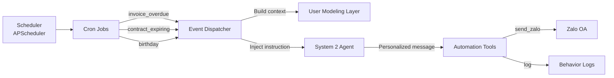

# 07. Proactive Reminders & Background Events

## 1. Vai Trò

Proactive Reminders là các **hành động tự động** mà hệ thống thực hiện **không cần user yêu cầu**. Đây là điểm khác biệt lớn so với chatbot thông thường - hệ thống **chủ động** giao tiếp với khách thuê.

## 2. Các Loại Sự Kiện Nền (7 cron jobs)

| Event | Cron Schedule | Priority | Tool cần |
|-------|:---:|:--------:|:---------|
| `invoice_overdue` | 09:00 daily | High | automation |
| `payment_due_soon` | 08:00 daily | Normal | automation |
| `contract_expiring` | 10:00 ngày 1 hàng tháng | High | knowledge, automation |
| `birthday_greeting` | 07:00 daily | Low | automation |
| `persona_optimizer` | Trigger-based | Low | — |
| `conversation_cleanup` | 03:00 daily | Low | — |
| `maintenance_reminder` | 08:00 daily (cùng job với payment_due_soon) | Normal | automation |

**Xóa khỏi thiết kế cũ** (chưa implement): `lease_anniversary`, `room_transfer_offer`, `welcome_message`.

## 3. Kiến Trúc Cron + Event



## 4. Cron Job Implementation

### 4.1. Scheduler Setup

```python
# src/cron/scheduler.py
from apscheduler.schedulers.asyncio import AsyncIOScheduler
from apscheduler.triggers.cron import CronTrigger

scheduler = AsyncIOScheduler()

# Chạy mỗi ngày lúc 9h sáng
scheduler.add_job(
    check_invoice_overdue,
    CronTrigger(hour=9, minute=0),
    id="invoice_overdue_check"
)

# Chạy mỗi ngày lúc 8h sáng
scheduler.add_job(
    check_payment_due_soon,
    CronTrigger(hour=8, minute=0),
    id="payment_due_check"
)

# Chạy ngày 1 hàng tháng
scheduler.add_job(
    check_contract_expiring,
    CronTrigger(day=1, hour=10, minute=0),
    id="contract_expiring_check"
)

# Chạy mỗi ngày
scheduler.add_job(
    check_birthdays,
    CronTrigger(hour=7, minute=0),
    id="birthday_check"
)
```

### 4.2. Event Detector - Invoice Overdue

```python
async def check_invoice_overdue():
    """Mỗi ngày kiểm tra hóa đơn quá hạn."""
    overdue_invoices = db.query("""
        SELECT i.invoice_id, i.tenant_id, i.amount, i.due_date,
               EXTRACT(DAY FROM NOW() - i.due_date) as days_overdue,
               t.full_name, t.tone_preference
        FROM invoices i
        JOIN user_profiles t ON i.tenant_id = t.tenant_id
        WHERE i.status = 'unpaid'
          AND i.due_date < CURRENT_DATE
          AND NOT EXISTS (
              SELECT 1 FROM behavior_logs bl
              WHERE bl.tenant_id = i.tenant_id
                AND bl.action_type LIKE 'reminder_sent_%'
                AND bl.timestamp > NOW() - INTERVAL '2 days'
          )
    """)
    
    for invoice in overdue_invoices:
        await dispatch_event(
            event_type="invoice_overdue",
            tenant_id=invoice.tenant_id,
            data={
                "invoice_id": invoice.invoice_id,
                "amount": invoice.amount,
                "days_overdue": invoice.days_overdue
            },
            instruction=f"Kiểm tra thông tin khách thuê và soạn thông báo nhắc nhở đóng tiền nhà cá nhân hóa dựa trên thói quen của họ. Khách nợ {invoice.amount:,.0f}đ, đã quá hạn {invoice.days_overdue} ngày."
        )
```

## 5. Event Dispatcher

```python
class EventDispatcher:
    def __init__(self, react_agent, user_modeling, tool_registry):
        self.agent = react_agent
        self.uml = user_modeling
        self.tools = tool_registry
    
    async def dispatch(self, event_type: str, tenant_id: int, data: dict, instruction: str):
        """
        Dispatch a background event to System 2 for personalized action.
        """
        # 1. Build context (giống System 2 làm với user query)
        context = self.uml.build_context(tenant_id, instruction)
        
        # 2. Kiểm tra Golden Time (Khung giờ rảnh)
        profile = self.uml.get_profile(tenant_id)
        if hasattr(profile, 'personalization_profile') and profile.personalization_profile:
            pref = profile.personalization_profile.get("preferences", {})
            active_hours = pref.get("active_hours", "")
            # Nếu hiện tại KHÔNG PHẢI khung giờ rảnh -> Delay qua APScheduler
            if not self._is_golden_time(active_hours):
                self.scheduler.add_job(
                    self.dispatch,
                    trigger='date',
                    run_date=self._get_next_golden_time(active_hours),
                    args=[event_type, tenant_id, data, instruction]
                )
                return "Delayed to golden time"
        
        # 3. Select tools based on event type
        intent = self._event_to_intent(event_type)
        tools = self.tools.get_for_intent(intent)
        
        # 4. Run ReAct loop
        response = await self.agent.run(
            query=instruction,
            tenant_id=tenant_id,
            context=context,
            tools=tools,
            source="CRON"
        )
        
        # 5. Log
        self.uml.log_behavior(
            tenant_id=tenant_id,
            action_type=f"auto_{event_type}",
            description=response
        )
        
        return response
    
    # Trong codebase thực tế, event được map intent trực tiếp:
    EVENT_INTENT_MAP = {
        "invoice_overdue": "payment_reminder",
        "payment_due_soon": "payment_reminder",
        "contract_expiring": "contract_renewal",
        "maintenance_reminder": "maintenance_request",
        "birthday_greeting": "general_chat",
    }

    # Không có các event: lease_anniversary, room_transfer_offer, welcome_message
    # (đã loại bỏ khỏi thiết kế ban đầu)
```

## 6. Personalization Examples

### 6.1. Invoice Overdue - Friendly Tone

**Tenant profile**: `tone_preference: friendly`, hay quên đóng tiền ngày 5, thường chuyển khoản

**System 2 output**:
```
"Anh Minh ơi, tháng này mình quên đóng tiền phòng rồi nè 😅
Số tiền 3.500.000đ, hạn chót là ngày 01/06.
Anh chuyển khoản giúp mình qua STK 123456789 - Vietcombank nha.
Cảm ơn anh! 🙏"
```

### 6.2. Invoice Overdue - Strict Tone

**Tenant profile**: `tone_preference: strict`, thường đóng trễ

**System 2 output**:
```
"Thông báo: Hóa đơn phòng 205 - tháng 06/2026
Số tiền: 3.500.000 VND
Quá hạn: 3 ngày
Vui lòng thanh toán trong vòng 24h. Sau thời gian này sẽ áp dụng phí trễ hạn."
```

### 6.3. Contract Expiring

**Tenant profile**: Ở 2 năm, từng gia hạn 1 lần, có intent ở lâu dài

**System 2 output**:
```
"Chào anh Tuấn! Hợp đồng phòng 302 của mình sắp hết hạn vào 30/06 (còn 30 ngày nữa).
Anh có muốn gia hạn tiếp không ạ? 
Mình có thể giữ nguyên giá phòng 4.5tr như cảm ơn anh đã ở với mình 2 năm qua.
Anh trả lời để mình chuẩn bị hợp đồng mới nha!"
```

## 7. Anti-Spam Protection

Tránh gửi quá nhiều thông báo gây khó chịu:

```python
class AntiSpamGuard:
    MAX_REMINDERS_PER_TENANT_PER_WEEK = 2
    MIN_HOURS_BETWEEN_REMINDERS = 24
    
    def can_send(self, tenant_id: int, event_type: str) -> bool:
        # Check 1: Số lượng reminder tuần này
        week_count = db.query("""
            SELECT COUNT(*) FROM behavior_logs
            WHERE tenant_id = %s
              AND action_type LIKE 'auto_%'
              AND timestamp > NOW() - INTERVAL '7 days'
        """, tenant_id)[0]
        
        if week_count >= self.MAX_REMINDERS_PER_TENANT_PER_WEEK:
            return False
        
        # Check 2: Reminder gần nhất cách bao lâu
        last_reminder = db.query("""
            SELECT MAX(timestamp) FROM behavior_logs
            WHERE tenant_id = %s
              AND action_type LIKE 'auto_%'
        """, tenant_id)[0]
        
        if last_reminder and (datetime.now() - last_reminder).total_seconds() < self.MIN_HOURS_BETWEEN_REMINDERS * 3600:
            return False
        
        # Check 3: Tenant có opt-out không
        opt_out = db.query("""
            SELECT notification_opt_out FROM user_profiles
            WHERE tenant_id = %s
        """, tenant_id)
        
        if opt_out and event_type in opt_out:
            return False
        
        return True
```

## 8. Delivery Channel Selection

Trong codebase hiện tại, channel được xác định đơn giản hơn (không có select_channel riêng):
- **Mặc định**: Zalo (dựa trên `communication_preference` trong profile)
- **Fallback**: SMS (nếu Zalo API fail)
- Không có multi-channel gửi đồng thời

## 9. Anti-Spam Global Rate Limiter

Ngoài AntiSpamGuard per-tenant, có global rate limiter (token bucket):
```python
class ReminderBucket:
    capacity = 100       # tối đa 100 reminders
    refill_rate = 10     # 10 reminders mỗi phút
```

## 10. Monitoring Dashboard

```python
class ProactiveMetrics:
    events_dispatched_today: int
    events_by_type: dict
    success_rate: float
    avg_personalization_score: float  # 0-1, do LLM tự đánh giá
    opt_out_rate: float
    cost_per_event: float
    tenant_satisfaction_proxy: float  # Dựa trên reply rate sau reminder
```

## 11. Configuration

```yaml
cron:
  enabled: true
  timezone: "Asia/Ho_Chi_Minh"
  
  rules:
    invoice_overdue:
      enabled: true
      check_time: "09:00"
      grace_days: [1, 3, 7]  # Gửi vào ngày quá hạn +1, +3, +7
    
    contract_expiring:
      enabled: true
      check_day: 1
      check_time: "10:00"
      notify_days_before: [30, 14, 7, 1]
    
    maintenance_reminder:
      enabled: true
      check_time: "08:00"
    
    birthday_greeting:
      enabled: true
      check_time: "07:00"
      template: "Chúc mừng sinh nhật {name}! 🎂"
  
  anti_spam:
    max_reminders_per_week: 2
    min_hours_between: 24
```

## 12. Edge Cases

| Case | Xử lý |
|------|-------|
| Tenant đã trả tiền trước khi reminder gửi | Re-check trước khi gửi |
| Zalo API down | Fallback SMS |
| LLM sinh message có lỗi chính tả | Validate + retry |
| Tenant phàn nàn về spam | Tăng MIN_HOURS_BETWEEN cho tenant đó |
| Multi-tenant (nhiều boarding house) | Filter theo boarding_house_id |

## 13. Tham Khảo Code

- `../src/cron/scheduler.py` - APScheduler setup
- `../src/cron/event_dispatcher.py` - Main dispatcher
- `../src/cron/event_dispatcher.py` - Main dispatcher (event detector tích hợp sẵn)
- `../database/views/reminder_queries.sql` - SQL views cho event detection
- `../src/notifications/zalo_client.py` - Zalo OA client
- `../tests/test_proactive_event.py` - Test cases
