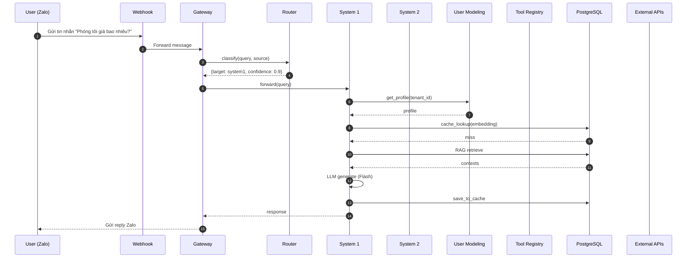
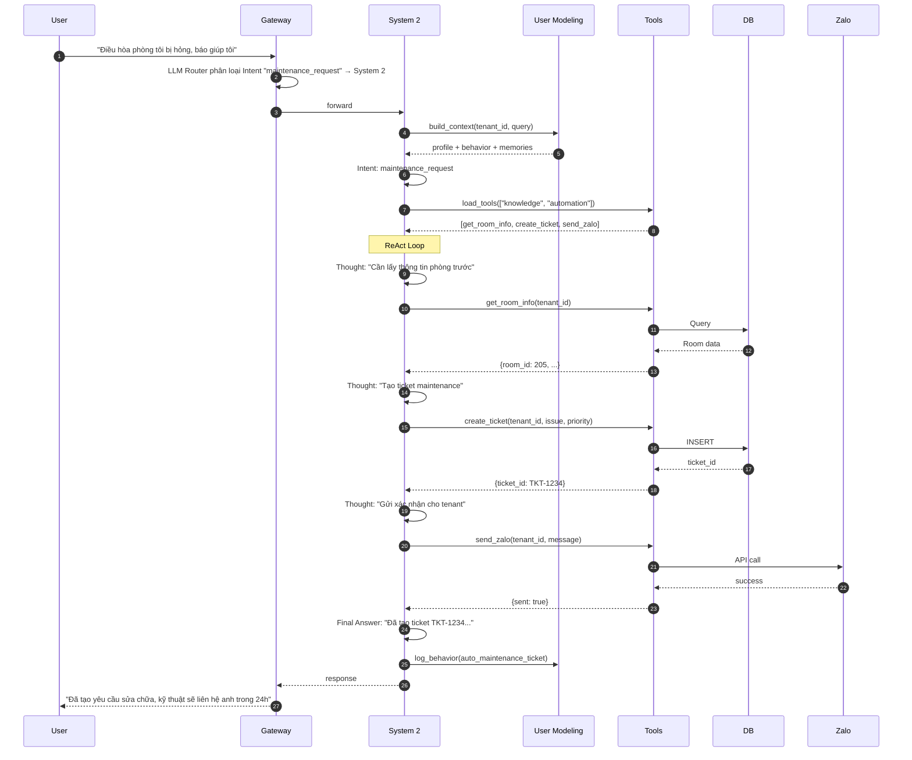
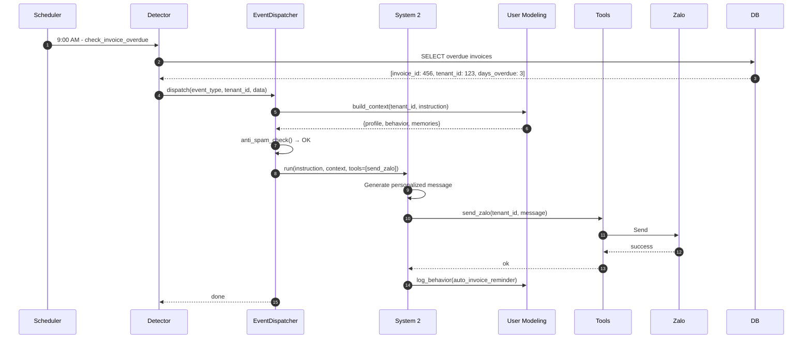
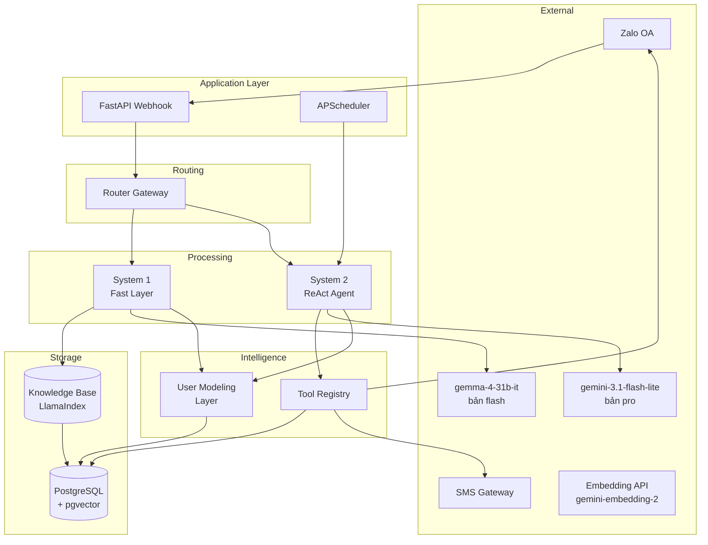
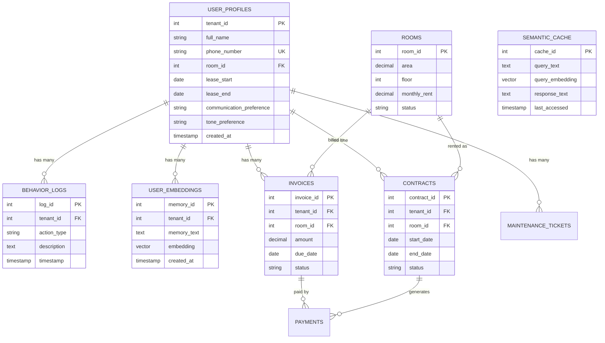
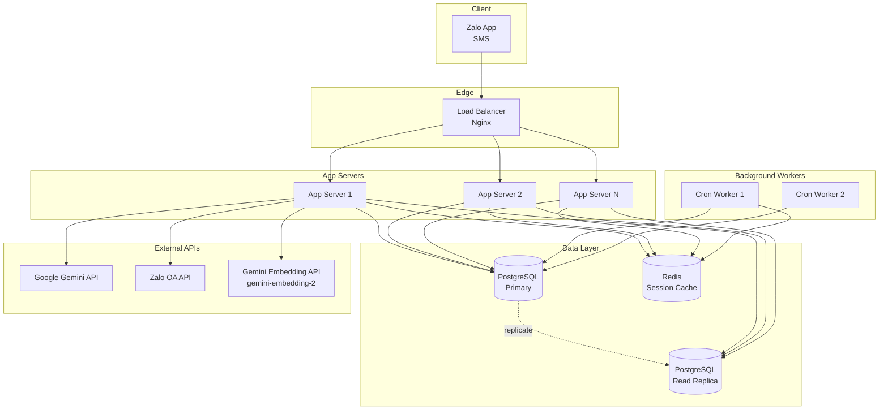
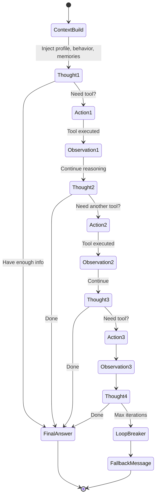

# 08. Data Flow & Diagrams

## 1. End-to-End Request Flow

## 2. Complex Request Flow (System 2)

## 3. Background Event Flow (Cron)

## 4. Component Architecture

## 5. Database ERD

## 6. Deployment Architecture

## 7. State Machine - ReAct Loop

## 8. Performance Characteristics

| Operation | Latency P50 | Latency P99 |
|-----------|-------------|-------------|
| Gateway routing | 10ms | 50ms |
| Embedding generation | 80ms | 200ms |
| Cache lookup (pgvector) | 15ms | 50ms |
| System 1 (cache hit) | 150ms | 300ms |
| System 1 (cache miss + RAG) | 1.5s | 3s |
| System 2 (1 tool call) | 4s | 8s |
| System 2 (2-3 tool calls) | 8s | 15s |
| ReAct fallback | 12s | 18s |
| Zalo send | 200ms | 500ms |
| Behavior log write | 5ms | 20ms |

## 9. Tham Khảo Diagrams

- `../diagrams/01_architecture_overview.mmd` - Overview
- `../diagrams/02_router_logic.mmd` - Router decision
- `../diagrams/03_react_loop.mmd` - ReAct detail
- `../diagrams/04_proactive_event.mmd` - Cron event
